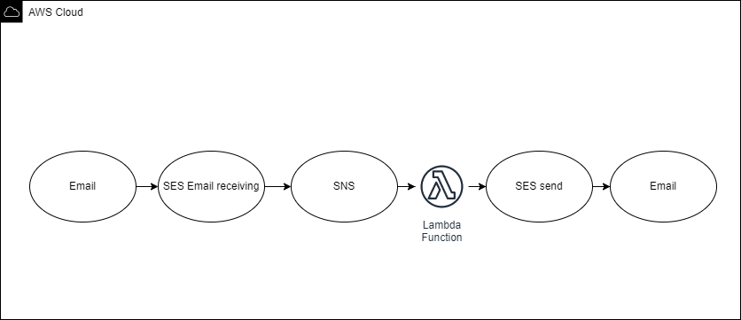

# SES->SNS email parser

Here's a simple Cloudformation stack that once deployed, would parse SES emails received through the "Email receiving" service, format, and finally send them to your email address.

## Requirements
* Node.js installed: https://nodejs.org
* AWS CLI with sufficient permissions to create a stack, SNS topic, pass a role, SES send an email, and create a Lambda function.

## Installation Instructions


Edit deploy.sh(or deploy.bat if you're running on Windows), replacing TEMPLATE_BUCKET and EMAIL with your bucket and email address.
TEMPLATE_BUCKET is the bucket where Cloudformation will store artifacts during deployment and EMAIL is an address where you'll receive emails mapped from Amazon SES.

Afterward, from the command line, run:

Windows environment:
```
deploy.bat
```

Otherwise, if you're running Linux:
```
deploy.sh
```

Once deployment is done head over to AWS SES->email receiving.
Provided you've already verified the domain and created a rule set, setup receipt rule, the only thing left is to add an action so that your email is forwarded to an SNS topic. The topic name you'll forward the email to is named similar to "Email-SES-SNS-Lambda-SNSTopic-youruniquestackID". Once done, you should be set.
Sending emails will be properly forwarded and parsed to the email you previously set up in the EMAIL variable.

## How it works



Lambda function is written in NodeJS 14.

--
